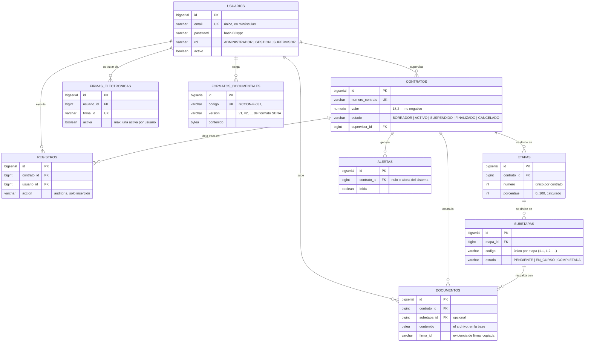

# Modelo de datos de SICOT

Referencia única del esquema de la base de datos: qué guarda cada tabla, qué
reglas impone, dónde se imponen y por qué. Para levantar o conectarse a una base
local, ver [LOCAL_DATABASE.md](LOCAL_DATABASE.md); para respaldos,
[BACKUP_Y_RESTAURACION.md](BACKUP_Y_RESTAURACION.md).

## Reglas de propiedad del esquema

Tres reglas gobiernan todo lo que sigue. Romper cualquiera de las tres es lo que
produjo el desfase que se describe más abajo.

1. **Flyway es el único dueño del esquema.** Las tablas se crean y se alteran
   exclusivamente desde `backend/src/main/resources/db/migration/`. Ni pgAdmin,
   ni Adminer, ni `psql` a mano, ni Hibernate.
2. **Hibernate valida, no genera.** En todos los perfiles salvo `test`,
   `spring.jpa.hibernate.ddl-auto=validate`. Si una entidad y el esquema dejan de
   coincidir, el backend se niega a arrancar en vez de operar sobre un esquema
   que no entiende.
3. **Las migraciones aplicadas no se editan nunca.** Flyway guarda una suma de
   verificación de cada archivo; cambiar uno ya aplicado hace fallar el arranque.
   Toda corrección va en una migración nueva.

## Diagrama entidad-relación



## Las tablas, una por una

### `usuarios`

Las cuentas del sistema. `password` guarda un hash BCrypt, nunca la contraseña.
`email` es la identidad de inicio de sesión y se normaliza a minúsculas en
`UsuarioService` antes de guardarse, para que la unicidad de la columna no se
pueda burlar cambiando mayúsculas.

Regla que no vive en la base: **siempre debe quedar al menos un administrador
activo**. La impone `UsuarioService`, en los dos caminos que podrían violarla
(desactivar la cuenta y cambiarle el rol). No es una restricción SQL porque
depende de un conteo sobre el resto de la tabla, y expresarlo como CHECK exigiría
un disparador; el punto único de escritura es la API, y ahí está cubierto.

### `contratos`

El contrato como objeto administrativo. `supervisor_id` puede ser nulo: un
contrato nace en `BORRADOR` sin supervisor y se le asigna después. Los contratos
**no se borran** — no existe endpoint de eliminación — porque son el ancla de
toda la trazabilidad del sistema.

| Restricción | Qué impide |
| --- | --- |
| `ck_contratos_estado` | Un estado fuera del enum `EstadoContrato` |
| `ck_contratos_valor` | Valor negativo |
| `ck_contratos_fechas` | Fecha de fin anterior a la de inicio |
| `contratos_numero_contrato_key` | Dos contratos con el mismo número |

Las transiciones de estado permitidas las decide `TransicionesDeEstado`, no la
base: la máquina de estados completa del SENA no está confirmada y el código solo
cierra lo que sí contradice el procedimiento (volver a `BORRADOR`).

### `etapas` y `subetapas`

Las 6 etapas y 27 subetapas del procedimiento **GCCON-P-010**, creadas
automáticamente al crear un contrato desde la plantilla fija
`GcconP010Plantilla`. `etapas.porcentaje` y `etapas.estado` son **derivados**: los
recalcula `EtapaService` a partir del estado de las subetapas cada vez que una
cambia. No se editan directamente.

`uq_etapas_contrato_numero` y `uq_subetapas_etapa_codigo` impiden duplicar un paso
del procedimiento dentro del mismo contrato.

### `documentos`

Los archivos del expediente contractual, guardados **en la base** como `bytea` y
no en disco. Es deliberado: un archivo en disco y una fila que lo referencia se
desincronizan (respaldo parcial, restauración a otra máquina, borrado manual), y
en un expediente contractual la fila sin el archivo no sirve de nada. El límite de
25 MB por archivo lo impone `spring.servlet.multipart.max-file-size`.

`firma_id` copia el identificador de `firmas_electronicas.firma_id` en el momento
de firmar y **no es clave foránea a propósito**: es evidencia histórica. Si la
firma del usuario se revoca o se reemplaza después, el documento debe seguir
diciendo con qué firma se selló, no apuntar a la vigente.

`subetapa_id` es opcional y `ON DELETE SET NULL`: un documento puede existir sin
estar atado a un paso concreto del procedimiento.

### `firmas_electronicas`

La firma electrónica asignada a una cuenta. Dos reglas, ambas en la base:

- `uq_firmas_electronicas_firma_id` — el identificador es único en todo el
  sistema. Sin esto, un `documentos.firma_id` dejaría de identificar a una sola
  persona y la trazabilidad de la firma se perdería.
- `uq_firma_activa_por_usuario` — **índice parcial** (`WHERE activa = TRUE`): un
  usuario tiene como máximo una firma activa, pero puede acumular cuantas
  revocadas haga falta. `DocumentoService.firmar` resuelve la firma con
  `findFirstByUsuarioIdAndActivaTrue`; con dos activas, "primera" sería el orden
  arbitrario del motor.

Asignar una firma a alguien que ya tiene revoca la anterior automáticamente
(`FirmaElectronicaService.crear`). Las firmas revocadas se conservan, nunca se
borran: los documentos ya firmados con ellas deben seguir siendo rastreables.

### `formatos_documentales`

Catálogo de los formatos institucionales del SENA (GCCON-F-031, GIL-F-010, …) que
Gestión carga como plantillas. `version` es la versión del **formato del SENA**
(v1, v2, …) y la calcula la aplicación al recargar el mismo código — no confundir
con `lock_version`, que es del control de concurrencia.

### `alertas` y `registros`

Las dos tablas que **crecen sin techo** con el uso normal del sistema; el resto
está acotado por lo que el centro alcanza a tramitar. De ahí dos decisiones:

- Los listados globales paginan con un tope duro de 500 filas
  (`AlertaService`, `RegistroService`).
- Tienen índices compuestos `(contrato_id, fecha DESC)` además del índice por
  fecha global, para que el listado por contrato no ordene la tabla en memoria.

`registros` es la auditoría y es de **solo inserción**: sus filas nunca se
modifican ni se borran. `alertas.contrato_id` puede ser nulo (alerta del sistema,
no de un contrato concreto).

## Concurrencia: `lock_version`

Siete tablas tienen una columna `lock_version` que gestiona Hibernate
(`@Version`). En cada `UPDATE`, Hibernate exige que la versión no haya cambiado
desde que leyó la fila; si otra transacción la movió, la escritura falla y
`GlobalExceptionHandler` responde **409** pidiendo recargar.

Sin esto, dos transacciones que leían la misma fila y la guardaban una tras otra
terminaban ambas con éxito y el cambio de la primera desaparecía sin dejar
rastro.

**Alcance actual:** protege transacciones que se solapan en el servidor. **No**
cubre el caso "abrí el formulario hace cinco minutos y guardo ahora": esa
petición vuelve a leer la fila y sobrescribe sin conflicto. Cerrar también ese
escenario exige que el cliente devuelva la versión que leyó, lo que implica
exponer `lock_version` en los DTO de respuesta y exigirla en los de
actualización. La columna es el requisito previo de eso.

`alertas` y `registros` no la llevan: `registros` nunca se actualiza y `alertas`
solo cambia por `leida = true`, donde "gana la última escritura" es el
comportamiento correcto.

## Qué NO está en la base (y por qué)

- **Las listas de chequeo** (GCCON-F-026, -F-049, …) viven en
  `backend/src/main/resources/listas-chequeo/*.json`. No son datos
  transaccionales: son el texto de un formato institucional que cambia solo
  cuando el SENA publica una versión nueva, y esa versión se integra regenerando
  el JSON. El catálogo se carga al arrancar y el arranque falla si un archivo
  está corrupto o repite un código.
- **La plantilla de las 6 etapas / 27 subetapas** está en `GcconP010Plantilla`,
  por la misma razón. Lo que sí se guarda son las etapas concretas de cada
  contrato, instanciadas desde esa plantilla.
- **Los usuarios de demostración** los crea `DataInitializer` solo en los perfiles
  `dev` y `test`. Ninguna migración inserta ni borra datos.

## Inventario de migraciones

| Archivo | Qué hace |
| --- | --- |
| `V1__create_sicot_schema.sql` | Línea base: las nueve tablas, sus restricciones e índices |
| `V9__add_indices_fecha_alertas_registros.sql` | Índices por fecha para los listados globales |
| `V10__reconcilia_esquema_con_la_linea_base.sql` | Restaura las siete restricciones que faltaban en las bases antiguas |
| `V11__indices_compuestos_tablas_de_crecimiento_libre.sql` | `(contrato_id, fecha DESC)` en `alertas` y `registros` |
| `V12__bloqueo_optimista.sql` | Columna `lock_version` en siete tablas |
| `V13__huella_de_integridad_en_la_firma.sql` | `firma_hash_sha256` y `firmado_por_id` en `documentos` |

El salto de `V1` a `V9` es intencional: las `V1`–`V8` originales se consolidaron
en la `V1` actual y la `V9` se conservó porque ya estaba aplicada en bases
existentes. No falta ninguna migración.

### La consolidación fue una excepción irrepetible

Consolidar migraciones ya aplicadas exige reparar a mano el historial de Flyway
de cada base existente. Eso fue viable en agosto de 2026 porque todas las bases
eran de desarrollo y desechables.

**Sobre una base con datos oficiales no se puede hacer.** Con
`validate-on-migrate=true` y `baseline-on-migrate=false` (ver
`application.properties`, donde ambos están declarados en voz alta justamente
por esto), cambiar el contenido de una migración ya aplicada hace que el backend
**se niegue a arrancar** con `Migration checksum mismatch`, y la única salida es
editar `flyway_schema_history` en producción — sobre datos que no se pueden
volver a generar.

La regla, a partir del primer despliegue real: **una migración aplicada nunca se
edita, se renombra ni se borra.** Todo cambio de esquema es una migración nueva
con el número siguiente, por pequeño que parezca. Si una migración ya desplegada
resulta estar mal, se corrige con otra migración que deshaga o ajuste lo que
hizo, nunca modificando la original.

## El desfase de esquema de agosto de 2026, y cómo no se repite

**Qué pasó.** Al consolidar `V1`–`V8` en la nueva `V1`, esta añadió siete objetos
de integridad que las originales no tenían. Para que las bases existentes no
fallaran la validación de sumas de verificación, se reparó su historial de Flyway
marcando la `V1` nueva como aplicada. Pero el SQL nuevo nunca se ejecutó: esos
siete objetos quedaron ausentes en toda base creada antes de la consolidación.

**Qué se rompió.** El proyecto pasó a tener dos esquemas distintos con el mismo
historial. Una base de desarrollo antigua aceptaba `valor = -1` y dos firmas
activas por usuario; una base creada después las rechazaba. Los defectos que
dependían de eso solo aparecían en las bases nuevas — es decir, en el primer
despliegue de producción. `FirmaElectronicaService` tenía uno exactamente así:
reasignar firma fallaba con un 409 incomprensible sobre PostgreSQL, y en las
pruebas pasaba porque H2 no tiene índices parciales.

**Por qué no se detectó.** Toda la suite corría sobre H2 con
`ddl-auto=create-drop`: Hibernate derivaba el esquema de las propias entidades y
Flyway ni se ejecutaba. Ese montaje es incapaz por construcción de detectar un
desfase — valida el esquema que él mismo acaba de generar.

**Qué lo impide ahora.** Tres controles, en orden de rapidez:

| Control | Dónde | Qué detecta |
| --- | --- | --- |
| `RestriccionesDeEnumEnMigracionesTest` | Cada `mvn test`, sin base | Un enum de Java cuyos valores ya no coinciden con su `CHECK` |
| `EsquemaPostgreSqlIntegrationTest` | CI, con PostgreSQL real | Migraciones y entidades que dejaron de coincidir; restricciones e índices ausentes; que `V10` sepa reparar una base desfasada |
| `ddl-auto=validate` | Arranque de la aplicación | Última red: el backend no arranca sobre un esquema que no entiende |

La segunda se salta sola si no hay base, así que `mvn verify` sigue en verde en
una máquina sin PostgreSQL. En CI el servicio siempre está, así que allí siempre
corre. Para ejecutarla a mano, ver el javadoc de la clase.

## Comparar dos bases

Cuando haga falta confirmar que dos bases (por ejemplo la nativa del `5432` y la
del contenedor en el `5433`) tienen el mismo esquema, esta consulta produce una
firma comparable línea a línea con `diff`:

```sql
SELECT 'COLUMNA  ' || table_name || '.' || column_name || ' ' || data_type
       || ' null=' || is_nullable || ' def=' || COALESCE(column_default, '-')
  FROM information_schema.columns
 WHERE table_schema = 'public' AND table_name <> 'flyway_schema_history'
UNION ALL
SELECT 'RESTRIC  ' || rel.relname || '.' || con.conname || ' ' || pg_get_constraintdef(con.oid)
  FROM pg_constraint con
  JOIN pg_class rel ON rel.oid = con.conrelid
  JOIN pg_namespace n ON n.oid = rel.relnamespace
 WHERE n.nspname = 'public' AND rel.relname <> 'flyway_schema_history'
UNION ALL
SELECT 'INDICE   ' || tablename || '.' || indexname || ' '
       || regexp_replace(indexdef, '^CREATE (UNIQUE )?INDEX \S+ ON \S+ ', '')
  FROM pg_indexes
 WHERE schemaname = 'public' AND tablename <> 'flyway_schema_history'
ORDER BY 1;
```

Consultar los catálogos `pg_constraint` y `pg_indexes` **siempre filtrando por
esquema**: son catálogos de toda la base, no del esquema actual. Una consulta sin
ese filtro encuentra objetos de otros esquemas —por ejemplo el esquema desechable
que crea la prueba de verificación— y da falsos positivos.
